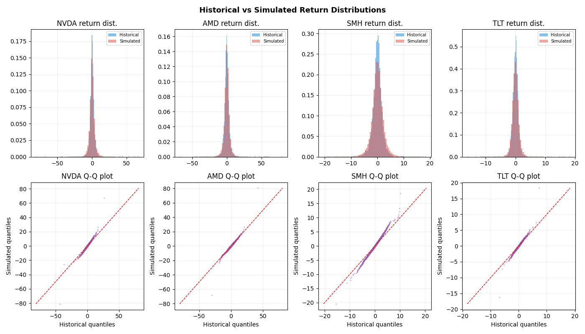
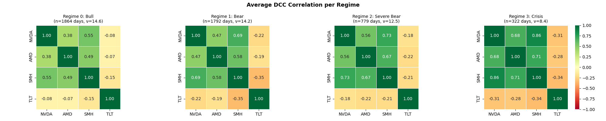
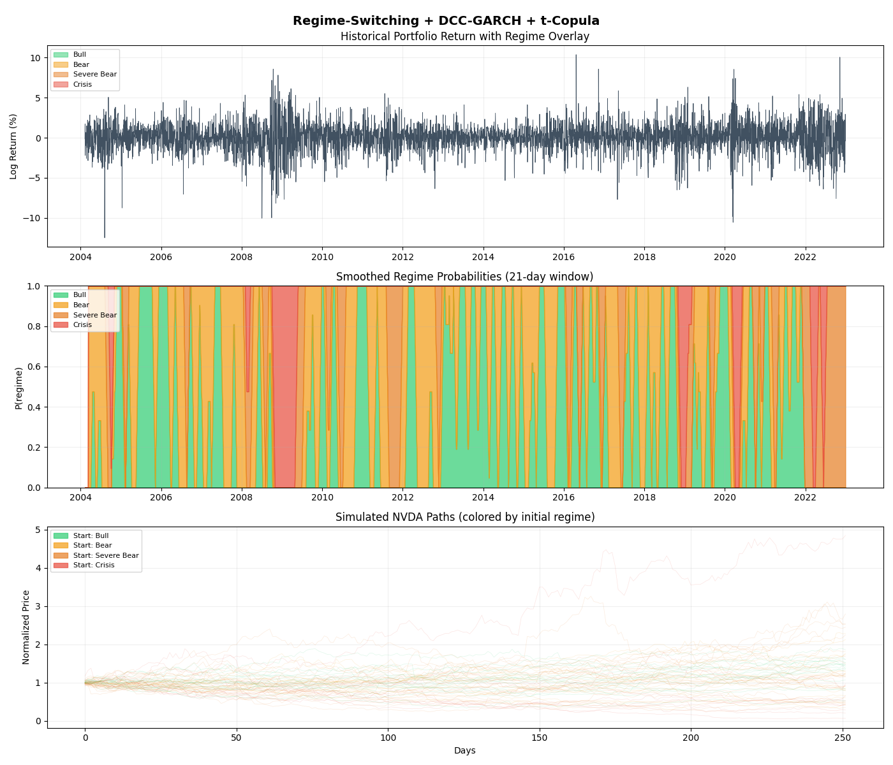

# Belief-State Hierarchical Reinforcement Learning for Risk-Constrained Portfolio Allocation

> Project Progress Memorandum

A reinforcement learning system for dynamic portfolio allocation under realistic institutional constraints, combining hierarchical control, belief-state regime inference, and risk-aware utility optimization.

---

## Table of Contents

- [Overview](#overview)
- [Problem Formulation](#problem-formulation)
  - [State Space](#state-space)
  - [Action Space and Hierarchical Control](#action-space-and-hierarchical-control)
  - [Reward Function](#reward-function)
  - [Transition Dynamics](#transition-dynamics)
- [Learning Objective](#learning-objective)
  - [PPO](#proximal-policy-optimization-ppo)
  - [SAC](#soft-actor-critic-sac)
  - [Experimental Strategy](#planned-experimental-strategy)
- [Conceptual Integration](#conceptual-integration)
- [Project Status](#current-status-and-next-steps)

---

## Overview

This project investigates the use of **reinforcement learning (RL)** for dynamic portfolio allocation under realistic institutional constraints. The primary objective is to design a system that allocates capital across a small set of assets — **NVDA, AMD, SMH, TLT, and cash (T-Bills)** — while explicitly controlling for risk, drawdowns, and investor preferences.

Unlike traditional portfolio optimization methods, which rely on static assumptions or one-step optimization, this project formulates allocation as a **sequential decision-making problem**. The system adapts daily, rebalancing a portion of the portfolio while considering both current market conditions and the evolving portfolio state.

A key innovation is the use of a **hierarchical reinforcement learning framework** combined with a **belief-state representation** of market regimes. The resulting model is designed to behave more like a professional portfolio manager, balancing growth and risk while responding dynamically to changing market environments.

**Asset Universe:**
- NVDA (NVIDIA)
- AMD (Advanced Micro Devices)
- SMH (Semiconductor ETF)
- TLT (Long-Term Treasury ETF)
- Cash (T-Bills)

---

## Problem Formulation

The portfolio allocation problem is formulated as a **Partially Observable Markov Decision Process (POMDP)**, reflecting the fact that the true underlying market regime is latent and must be inferred from observable financial signals. The environment is defined by the tuple:

$$\langle \mathcal{S}, \mathcal{A}, R, P, \gamma \rangle$$

Where:
- $\mathcal{S}$ — state space
- $\mathcal{A}$ — action space
- $P(s_{t+1} \mid s_t, a_t)$ — transition dynamics
- $R(s_t, a_t)$ — reward function
- $\gamma$ — discount factor

At each time step $t$, the agent observes a state $s_t$ representing a belief-state approximation of the latent market regime:

$$s_t \approx b_t = P(z_t \mid \text{observations})$$

where $z_t$ denotes the unobserved regime.

### State Space

The state aggregates technical indicators, volatility/correlation structure, wavelet-based multi-scale features, and forward-looking signals from the Kronos forecasting system. Collectively, these features allow the agent to infer whether the market is trending, volatile, stable, or undergoing structural transition.

#### Feature Vector

| Component | Role |
|-----------|------|
| Rolling returns (3, 7, 14, 30 days) | Local trend and momentum |
| Technical indicators (RSI, MACD, moving-average gaps) | Local trend and momentum |
| Rolling correlations among NVDA, AMD, SMH, TLT | Cross-asset structure |
| VIX level, changes, and normalized values | Volatility and market stress indicators |
| Relative performance of TLT versus equities | Hedge effectiveness signal |
| Current drawdown | Portfolio state |
| Gross and net exposure | Portfolio state |
| Current sleeve allocation | Portfolio state |
| Wavelets | Multi-scale regime structure |
| Kronos forecasts | Forward-looking regime expectations |

#### Wavelet Features

We utilize a **discrete wavelet transform (DWT)**, specifically the **Daubechies-4 (db4)** wavelet, decomposed up to **level 4**. Financial time series are inherently multi-scale, with different behaviors emerging at:

- **Short-term** — noise / microstructure
- **Medium-term** — momentum / mean reversion
- **Long-term** — trend / regime shifts

For a given price series (e.g., SMH or NVDA), the wavelet transform produces:

$$\text{Signal} = A_4 + D_4 + D_3 + D_2 + D_1$$

| Component | Interpretation |
|-----------|---------------|
| $A_4$ | Low-frequency approximation (long-term trend, bull vs bear) |
| $D_4$, $D_3$ | Medium-to-long horizon fluctuations (cyclical behavior, transitions) |
| $D_2$, $D_1$ | High-frequency noise and short-term volatility bursts |

Wavelet-derived features include the energy (variance) of each component, normalized amplitudes, and ratios between low- and high-frequency energy. These features are included primarily in the **high-level policy state**, as they describe market structure rather than asset-specific tactics.

#### Kronos Forecast Features

In addition to wavelet-based features, we incorporate **multi-horizon forecasts from the Kronos system**, which provide forward-looking information about expected price behavior. While technical indicators and wavelets are backward-looking, Kronos introduces a **forward-looking component**, allowing the agent to incorporate expectations about future market movements.

Kronos provides forecasts such as:
- Predicted future returns (multiple horizons)
- Prediction errors and stability metrics
- Directional accuracy (hit rates)
- Confidence measures

These outputs implicitly encode regime information:

| Forecast Pattern | Regime Implication |
|------------------|-------------------|
| High-confidence, low-error | Stable, predictable regime |
| Low-confidence, high-error | Unstable or transitioning regime |
| Consistent directional signals | Trending environment |
| Erratic signals | Noisy or regime-shifting environment |

Constructed features from Kronos outputs include rolling forecast error (RMSE / absolute error), forecast stability over time, directional hit rate, confidence score, and a "surprise" metric (deviation from expected error). These are included primarily in the **high-level policy state**.

### Action Space and Hierarchical Control

The action space $\mathcal{A}$ is structured hierarchically to reflect the separation between strategic risk allocation and tactical asset selection — a defining characteristic of institutional portfolio management. At each time step:

$$a_t = \left( a_t^{\text{HL}},\; a_t^{\text{LL}} \right)$$

| High-Level Policy (HL) | Low-Level Policy (LL) |
|------------------------|----------------------|
| Determines strategic posture for the sleeve being rebalanced: target **gross exposure** (risk budget) and target **net exposure** (directional bias) | Allocates the selected sleeve across NVDA, AMD, SMH, TLT, with residual capital assigned to **cash (T-Bills)** |

#### Sleeve-Based Execution Constraint

A key structural feature of the action space is the introduction of a **sleeve-based execution mechanism**. The portfolio is partitioned into $K = 5$ equal sleeves, and only **one sleeve is rebalanced at each time step**. The realized portfolio at time $t$ is:

$$w_t = \frac{1}{K} \sum_{k=0}^{K-1} w_{t-k}$$

where each $w_{t-k}$ corresponds to a sleeve allocation decided at a different past time.

This structure introduces **temporal coupling** between actions: a single decision affects portfolio composition over multiple future periods. The agent must learn policies that are inherently forward-looking, balancing immediate signals against their persistent impact on future portfolio states.

### Reward Function

The reward function approximates the objective of a professional asset manager operating under realistic institutional constraints. Rather than maximizing raw one-period returns, the agent optimizes a risk-adjusted utility functional that balances capital growth, drawdown control, trading efficiency, and sustained performance relative to a benchmark.

The agent maximizes:

$$\mathbb{E}\!\left[ \sum_{t=0}^{T} \gamma^t R_t \right]$$

where the per-period reward is:

$$
\begin{aligned}
R_t = \;& \log(1 + r_t) \\
      & - \lambda_{\text{dd}} \, \max\!\left(0,\; DD_t - DD^{*}\right)^{2} \\
      & - \lambda_{\text{to}} \, \tau_t \\
      & - \lambda_{\text{up}} \, \mathbf{1}\{B_t > 0\} \, \max(0,\; B_t) \\
      & - \lambda_{\text{down}} \, \mathbf{1}\{B_t < 0\} \, \max(0,\; -B_t)
\end{aligned}
$$

| Term | Purpose |
|------|---------|
| $\log(1 + r_t)$ | Long-term capital growth (concave transformation) |
| $\lambda_{\text{dd}} \, \max(0, DD_t - DD^{*})^{2}$ | Convex penalty on drawdowns beyond threshold $DD^{*}$ |
| $\lambda_{\text{to}} \, \tau_t$ | Turnover penalty for excessive trading |
| $\lambda_{\text{up}}$, $\lambda_{\text{down}}$ terms | Asymmetric penalties on relative performance vs benchmark |

The smoothed relative-performance process is:

$$B_t = \alpha \left( r_t^{p} - r_t^{\text{bench}} \right) + (1 - \alpha)\, B_{t-1}$$

This captures persistent outperformance or underperformance relative to a benchmark, ensuring the agent is penalized for **sustained deviations** rather than transient daily noise — aligning with practical evaluation horizons (weekly, monthly, quarterly).

Unlike drawdowns (direct capital impairment, requiring convex penalties), relative performance is modeled linearly after temporal aggregation. This prevents excessive benchmark tracking and preserves the agent's ability to pursue active strategies and generate alpha.

### Transition Dynamics

The evolution of the system is governed by:

$$P(s_{t+1} \mid s_t, a_t)$$

In practice:

$$s_{t+1} = f(s_t, a_t, \varepsilon_t)$$

where $f(\cdot)$ represents deterministic updates (portfolio accounting, sleeve aggregation, feature recomputation) and $\varepsilon_t$ represents stochastic market innovations.

#### State Transition Sequence

After rebalancing the selected sleeve:

1. The remaining four sleeves remain unchanged
2. The full portfolio is the aggregation of all five sleeves
3. Market returns are realized at $t+1$
4. Portfolio equity, drawdown, and exposures are updated

Because financial markets are non-stationary and their data-generating process is unknown, the transition distribution is **not explicitly modeled** but is implicitly defined through sampled transitions from historical or simulated data. The model operates as a **belief-state controller**, where features (correlations, volatility, TLT behavior) serve as proxies for hidden regimes.

---

## Learning Objective

The agent learns a policy $\pi(a_t \mid s_t)$ that maximizes expected discounted utility:

$$J(\pi) = \mathbb{E}_{\pi}\!\left[ \sum_{t=0}^{T} \gamma^t R_t \right]$$

The corresponding value functions are:

$$V_{\pi}(s_t) = \mathbb{E}_{\pi}\!\left[ \sum_{k=0}^{\infty} \gamma^k R_{t+k} \;\middle|\; s_t \right]$$

$$Q_{\pi}(s_t, a_t) = \mathbb{E}_{\pi}\!\left[ \sum_{k=0}^{\infty} \gamma^k R_{t+k} \;\middle|\; s_t, a_t \right]$$

These satisfy the Bellman relation:

$$Q_{\pi}(s_t, a_t) = R_t + \gamma \, \mathbb{E}_{s_{t+1}}\!\left[ V_{\pi}(s_{t+1}) \right]$$

The policy is learned using model-free RL algorithms (PPO and SAC), which rely on sampled transitions rather than explicit knowledge of $P(s_{t+1} \mid s_t, a_t)$.

### Proximal Policy Optimization (PPO)

PPO is selected as the **primary baseline algorithm**.

| Rationale | Role in Project | Advantages |
|-----------|-----------------|------------|
| Stable policy updates through clipping | Train both HL and LL policies | Robust under noisy financial data |
| Well-suited for custom environments | Establish baseline performance for return, drawdown, turnover, and market participation | Good balance between exploration and stability |
| Strong empirical performance in continuous control | | Widely accepted in academic and applied RL |
| Simpler to implement and explain | | |

### Soft Actor-Critic (SAC)

SAC is proposed as an **advanced alternative**.

| Rationale | Role in Project | Trade-offs |
|-----------|-----------------|------------|
| Designed for continuous action spaces | Benchmark against PPO | More sensitive to reward scaling |
| Incorporates entropy regularization for exploration | Evaluate whether entropy-driven exploration improves allocation smoothness, hedge utilization (TLT + shorting), and regime adaptation | More complex tuning |
| Often more sample-efficient | | Better suited after baseline validation |

## Synthetic Data Generator — Validation Results

This module produces synthetic market data for RL training using a **regime-switching DCC-GARCH model with a Student-t copula**. Four regimes (Bull, Bear, Severe Bear, Crisis) are identified via a Gaussian HMM on rolling features. Each regime has its own GARCH dynamics (or constant-variance fallback for sparse regimes), correlation structure, and tail dependence.

The following diagnostics validate that the generator produces realistic synthetic paths suitable for portfolio RL training.

---

### Return Distributions and Q-Q Plots

The simulator produces realistic extreme moves. NVDA's simulated quantiles reach ±80%, matching its historical extremes (worst day in 2008 ≈ −32%, best ≈ +30%; reaching these magnitudes across 500 simulated paths is correct).

The histograms (top row) show simulated distributions slightly **wider in the body** but matching tails well. This is the right tradeoff for RL training — over-representing moderate moves is preferable to under-representing extreme moves.

The TLT positive-tail outlier (one simulated point at ~18 vs historical ~8) reflects the Crisis regime where TLT has ν = 3.34 — the simulator correctly producing "March 2020 dash for cash" type events in TLT.

| Asset | Q-Q Behavior |
|-------|--------------|
| NVDA  | Hugs diagonal across full range, including ±80 tail |
| AMD   | Near-perfect diagonal alignment |
| SMH   | Slight over-coverage in tails (acceptable) |
| TLT   | Hugs diagonal cleanly |

---

### Regime-Dependent Correlation Structure

The correlation structure shows the classic **diversification breakdown** under stress. NVDA-SMH correlation strengthens monotonically across regimes:

| Regime | NVDA-SMH Correlation |
|--------|----------------------|
| Bull | 0.55 |
| Bear | 0.69 |
| Severe Bear | 0.73 |
| Crisis | **0.86** |

In the Crisis regime, holding multiple semiconductors offers essentially no diversification — they behave as a single position. An RL agent trained on this data will learn that semi diversification fails during crashes and TLT becomes the only effective hedge.

TLT-Equity correlation also strengthens with stress:

| Regime | TLT-Equity Correlation Range |
|--------|-------------------------------|
| Bull | −0.08 to −0.15 (TLT barely hedges) |
| Bear | −0.19 to −0.35 |
| Severe Bear | −0.18 to −0.22 |
| Crisis | −0.28 to −0.34 (meaningful hedge) |

Note: Severe Bear shows slightly weaker TLT hedging than Bear. This reflects 2022 episodes where TLT-equity correlation flipped due to the inflation regime — an honest representation of the data, not a model artifact.

---

### Regime Identification and Simulated Paths

**Top panel:** Historical daily portfolio log returns (2004–2022).

**Middle panel — Smoothed regime probabilities (21-day window):**

The regime classifier identifies real historical crises correctly. Distinct red Crisis blocks appear at:
- **Late 2008** — Lehman / Global Financial Crisis
- **Late 2018** — Q4 Fed-driven selloff
- **Early 2020** — COVID crash
- **Mid-late 2022** — inflation regime

**Bottom panel — Simulated NVDA paths colored by initial regime:**

- Path range at day 250 spans roughly **0.4× to 4.8× normalized price**
- Consistent with NVDA's historical ~50% annualized volatility
- Bull-started paths (green) tend to drift upward; Crisis-started paths (red) tend to drift down or stagnate
- The ~5× upside path is consistent with NVDA's history of multiple +200% years during the training window

---

## Volume Model Validation

The synthetic data generator includes a **regime-conditional asymmetric AR(1) log-volume model** that produces synthetic volume aligned with synthetic returns. The model is:

$$\log(V_t) = \alpha_r + \beta^+_r \cdot \max(r_t, 0) + \beta^-_r \cdot \min(r_t, 0) + \gamma_r \cdot \log(V_{t-1}) + \sigma_r \cdot \varepsilon_t$$

where parameters depend on regime $r$ and asset, and $\varepsilon_t \sim \mathcal{N}(0, 1)$.

### Empirical Volume-Return Coupling

The empirical $|r|$–$\log(V)$ correlations across regimes:

| Asset | Bull | Bear | Severe Bear | Crisis |
|-------|------|------|-------------|--------|
| NVDA  | 0.49 | 0.47 | 0.46        | 0.37   |
| AMD   | 0.35 | 0.35 | 0.23        | 0.01   |
| SMH   | 0.27 | 0.25 | 0.21        | 0.10   |
| TLT   | 0.36 | 0.36 | 0.41        | 0.38   |

**Key observations:**

**TLT is the only asset where Crisis has the strongest volume-return coupling** (0.41 in Severe Bear, 0.38 in Crisis). This is economically consistent — Treasuries see massive volume spikes during flight-to-quality events, and the relationship strengthens with stress.

**Equities show weakening coupling in Crisis** (NVDA: 0.49 → 0.37, AMD: 0.35 → 0.01, SMH: 0.27 → 0.10). This reflects volume saturation: in Crisis regimes, every day has high volume regardless of return magnitude, so the "bigger move = bigger volume" relationship weakens because volume is already at its ceiling.

**AMD Crisis coupling of 0.01 is notable.** With only 322 Crisis observations and AMD's idiosyncratic volume patterns, the return-volume signal effectively disappears. The fitted parameters ($\beta^+ = 0.0246$, $\beta^- = -0.0139$) reflect this — the model correctly learned "in Crisis, AMD return barely affects AMD volume." This is an honest fit rather than a model failure.

**AR(1) values are all 0.62–0.94**, indicating strong volume persistence (correct behavior). AMD Crisis shows $\gamma = 0.944$ — volume is extremely sticky in AMD Crisis, which combined with the low return-coupling suggests AMD volume in Crisis is essentially "high and persistent" with minimal modulation by daily returns.

### Volume Model Parameters — Sanity Check

The asymmetric coefficients capture the documented "volume on selling > volume on buying" pattern:

| Regime / Asset | $\beta^+$ | $\beta^-$ | Interpretation |
|----------------|-----------|-----------|----------------|
| SMH Bull       | 0.15      | -0.28     | Down-day volume premium |
| TLT Bull       | 0.41      | -0.45     | Slight asymmetry |
| TLT Bear       | 0.45      | -0.38     | Up-day premium (rare) |

The asymmetric model is capturing the volume-direction relationship as expected.

**$\gamma$ (persistence) decreases in Crisis for NVDA** (0.65 → 0.60) — volume is *less* persistent in Crisis, consistent with rapid volume shocks that decay quickly.

**$\gamma$ increases for AMD/SMH/TLT in stress** — volume is *more* persistent (high-volume days cluster). Different microstructure across assets, both patterns are plausible.

### Summary

The synthetic data generator delivers:

1. **Four economically meaningful regimes** with realistic durations (23–40 days expected)
2. **Realistic tail behavior** — the Student-t copula captures genuine tail dependence (ν between 8.4 and 14.6 across regimes), no longer collapsing to Gaussian
3. **Regime-dependent correlation structure** capturing diversification breakdown under stress
4. **Robust handling of small-sample regimes** via constant-variance + static copula fallback for Severe Bear and Crisis
5. **Clean historical regime identification** matching real GFC, COVID, 2018-Q4, and 2022 inflation episodes
6. **Simulated paths with realistic dispersion** including occasional explosive moves and severe drawdowns

This output is sufficient for the RL training pipeline. The next stages of the project — wavelet feature engineering, Kronos forecast integration, and the hierarchical RL environment — build on top of this synthetic data foundation.

### Kronos Regime Distribution Analysis

#### Overall Assessment ✅

**No bucket starvation.** Smallest bucket is **4.3%** (NVDA bucket 7) — well above the 1% concern threshold. Every regime fires often enough for the RL agent to learn meaningful policy responses to it.

Dominant patterns make economic sense across all four assets:

| Bucket | Description | Where it's prevalent |
|--------|-------------|----------------------|
| 2 (low_err + high_conf) | Best forecasts | Dominant in NVDA/AMD/SMH (24-28%) |
| 6 (high_err + low_conf) | Honestly poor forecasts | High in TLT (19.8%), AMD (16.4%) |
| 8 (high_err + high_conf) | Overconfident | Notably high in TLT (19.1%), AMD (12.7%) |

The fact that **bucket 2 is the largest bucket for the equities** says Kronos is reliably forecasting NVDA/AMD/SMH most of the time. Forecasts are accurate AND the model knows it.

#### The TLT Pattern Is the Interesting Story

TLT shows a strikingly different distribution from the equities:

| Asset | Bucket 2 (best) | Bucket 6 (honestly bad) | Bucket 8 (overconfident) |
|-------|-----------------|--------------------------|---------------------------|
| NVDA  | 24.7%           | 10.9%                    | 7.5%                      |
| AMD   | 24.3%           | 16.4%                    | 12.7%                     |
| SMH   | **27.5%**       | 8.7%                     | 9.4%                      |
| TLT   | 12.4%           | **19.8%**                | **19.1%**                 |

For TLT, the **"bad forecast" buckets (6 + 8) sum to 38.9%**, while for SMH they only sum to 18.1%. That's a 2× higher rate of poor Kronos performance on TLT vs. semiconductors.

This is consistent with the bucket-8 dates analysis done earlier. TLT had massive bucket-8 concentrations during 2007-2013 (post-GFC QE era) and 2020-2024 (post-COVID + inflation). **Kronos genuinely struggles with TLT** because central bank actions periodically restructure the bond market in ways pure technical analysis can't anticipate.

The agent learning policy on this data will discover: *"Kronos forecasts for TLT are less reliable than for equities — discount them more, rely more on the regime classifier."* That's exactly the right behavior.

#### Equities Differ in a Meaningful Way Too

Compare AMD vs. NVDA bucket 8 specifically:

| Asset | Bucket 8 (overconfident) | What this likely means |
|-------|---------------------------|--------------------------|
| NVDA  | 7.5%                      | Kronos rarely overconfident — appropriate humility |
| AMD   | 12.7%                     | Frequent overconfidence |
| SMH   | 9.4%                      | Mid-range |

AMD's higher bucket-8 fraction reflects the date-level analysis: AMD has a long history of idiosyncratic events (CEO changes, near-bankruptcies, fab spinoffs) that Kronos couldn't anticipate from technical patterns. The forecaster's confidence is poorly calibrated on AMD.

This is also why AMD bucket 0 is so much smaller (10.3%) than NVDA's (23.5%) — AMD has fewer "low error AND low confidence" days because Kronos is rarely cautious about AMD predictions, even when it should be.

#### What This Means for the RL Agent

Different regime distributions across assets means the agent will learn **asset-specific policies for using Kronos features**:

- **NVDA**: Trust Kronos when bucket 2 fires (high frequency, well-calibrated)
- **SMH**: Similar to NVDA, trust forecasts
- **AMD**: Use Kronos forecasts cautiously — discount them when bucket 8 fires
- **TLT**: Heavy skepticism toward Kronos — bucket 6/8 dominate, lean on regime probabilities and historical hedging behavior instead

The RL state vector will have separate one-hot regime columns per asset (`NVDA_kronos_regime_0` ... `NVDA_kronos_regime_8`, `AMD_kronos_regime_0` ... etc.), so the agent has **36 binary indicators just for Kronos quality** across the 4 assets. That's enough granularity to learn these asset-specific calibration patterns.

#### One Subtle Observation Worth Noting

The middle bucket (bucket 4 = mid_err + mid_conf) sits at 6-9% across all assets. That's healthier than initially expected. With expanding quantiles the middle bucket *could* have been very small (since the cross-product of "exactly middle on both axes" is statistically rare), but the observed populations are reasonable.

#### Bottom Line

These distributions are high-quality.

1. ✅ All buckets populated >4%, no starved categories
2. ✅ Dominant buckets are economically meaningful (2, 6, 8 — the three "extreme" combinations)
3. ✅ Asset-level differences match what you'd expect from real market dynamics
4. ✅ TLT vs. equity asymmetry confirms Kronos struggles more with bonds (correct empirical finding)

### Planned Experimental Strategy

1. Build and validate environment
2. Train baseline using **PPO**
3. Introduce **SAC** as comparison
4. Evaluate against the following metrics:
   - Cumulative return
   - Maximum drawdown
   - Sharpe ratio
   - Turnover
   - Upside / downside capture

---

## Conceptual Integration

The proposed framework integrates three key elements:

1. **Belief-state representation** — encodes a probabilistic view of latent market regimes
2. **Hierarchical action control** — provides a structured mechanism for risk allocation and asset selection under execution constraints
3. **Institutional utility optimization** — captures realistic investor preferences across multiple time horizons

This combination yields a reinforcement learning system that is not only mathematically well-defined but also aligned with the operational realities of portfolio management. By incorporating delayed action effects, regime inference, and multi-objective utility, the framework moves beyond standard RL formulations and provides a principled approach to adaptive portfolio allocation under uncertainty.

---

## Current Status and Next Steps

### Completed

- [x] Formal MDP / POMDP formulation
- [x] Hierarchical RL architecture (HL + LL)
- [x] Sleeve-based portfolio design
- [x] Feature engineering framework
- [x] Utility function design

### In Progress

- [ ] Environment implementation
- [ ] Validation of projection and constraints
- [ ] Initial policy training setup

### Next Steps

- [ ] Implement PPO baseline
- [ ] Validate training stability
- [ ] Introduce SAC comparison
- [ ] Conduct out-of-sample testing
- [ ] Evaluate robustness across regimes
