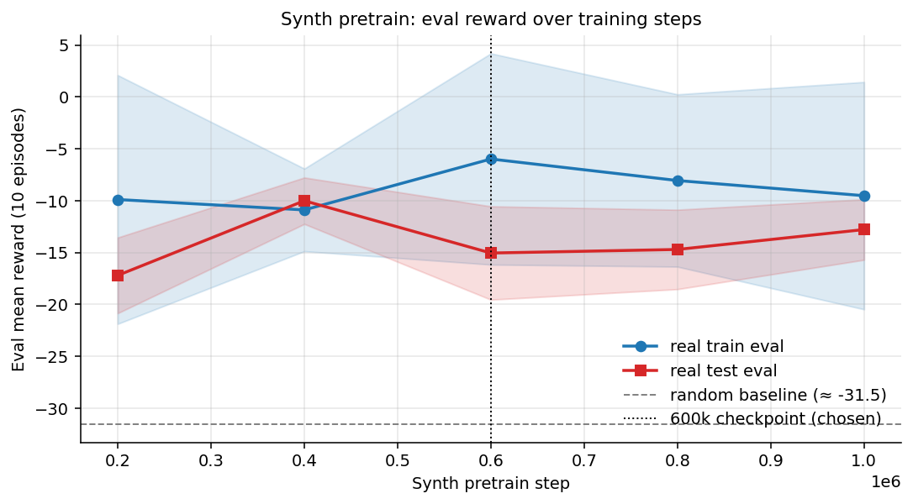
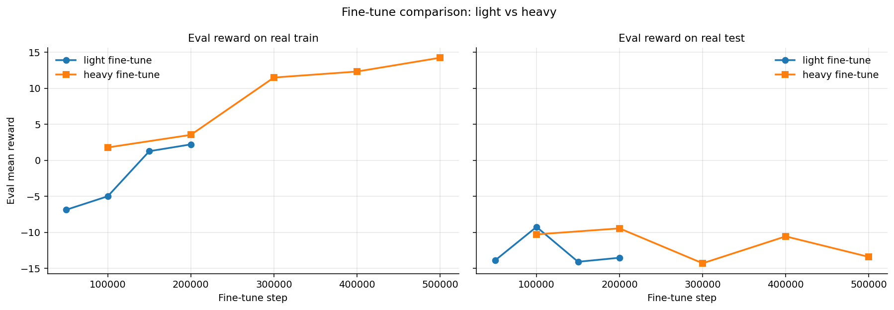
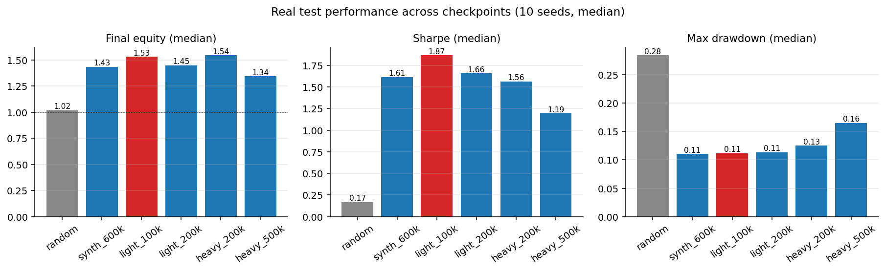
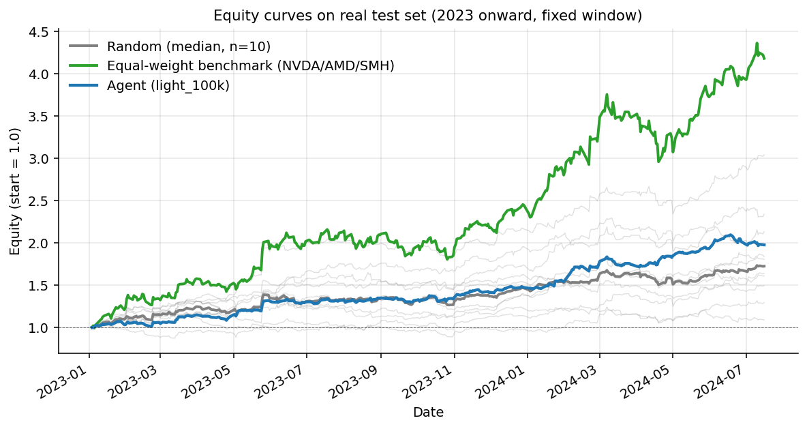
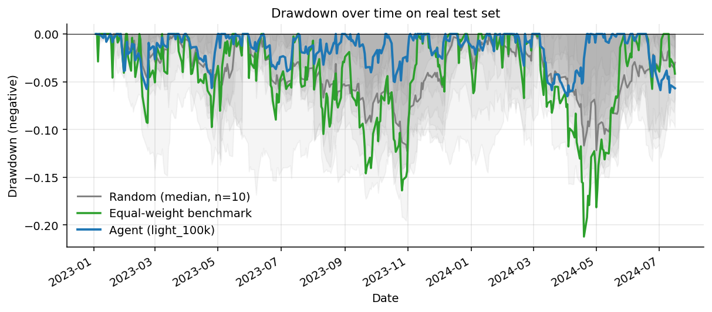
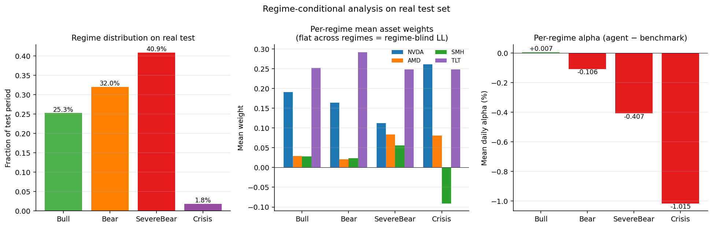

# Hierarchical Reinforcement Learning for Portfolio Allocation
## Phase 1 Report: Low-Level Policy

### Project setup

This project applies hierarchical reinforcement learning (HRL) to a four-asset portfolio allocation problem. The asset universe consists of three semiconductor-adjacent equities (NVDA, AMD, SMH) and a long-duration Treasury ETF (TLT) acting as a low-correlation hedge. Daily features comprise 313 columns spanning per-asset technical indicators, volume statistics, wavelet-based regime descriptors, a Kronos-derived regime classifier, pairwise asset correlations, and four soft regime-probability columns (Bull, Bear, SevereBear, Crisis) produced by an upstream classifier. Real data covers 2004–2022 for training (4,579 trading days) and 2023–2026 for held-out evaluation (829 days). A synthetic pool of 2,000 generated paths × 384 days × 313 features supplements the real training data with regime-balanced episodes.

The HRL design splits decisions across two timescales. A high-level (HL) controller chooses portfolio aggregate exposures `[gross, net]` ∈ [0, max_gross] × [-1, +1]. A low-level (LL) policy chooses per-asset weights given the HL action. The LL policy learns the *composition* of the portfolio; the HL learns the *posture*. This report covers the LL phase only; HL training is Phase 2.

### Environment design

The simulator is a standard Markovian portfolio environment with one non-trivial choice: rolling-window risk metrics computed in *excess* of an equal-weight benchmark, rather than absolute. The reasoning is that institutional risk management is judged on relative drawdowns: a 30% loss alongside a 30% benchmark loss is forgivable, a 30% loss when the benchmark is flat is not. The reward function reflects this:

- **Log-growth term.** Direct reward for portfolio return on each step.
- **Excess-drawdown penalty.** Quadratic penalty when (agent drawdown − benchmark drawdown) on a rolling 21-day or 63-day window exceeds a threshold (5% and 10% respectively).
- **Asymmetric quarterly benchmark term.** A 63-day rolling cumulative excess-return signal with 21-day warmup, with four asymmetric coefficients depending on the up/down × beat/miss matrix:
  - λ_upside_miss = 0.5: heavy penalty for failing to participate in rallies (career risk)
  - λ_upside_beat = 0.1: mild bonus for outperforming in rallies
  - λ_downside_excess = 0.1: mild penalty for underperforming in selloffs (forgivable)
  - λ_crisis_alpha = 0.5: heavy bonus for generating positive returns in selloffs

The asymmetry encodes a defensive PM's incentives: participate when markets rally, protect when they fall, capture alpha when they crash. A symmetric reward would produce a different policy.

Lookahead leakage is prevented by an explicit timing convention in `apply_allocation`: the agent observes features at end-of-day t (a synthetic 5-minute lookback would shift this slightly but does not change the structure), decides weights, and receives the realized return on those weights when day t+1 closes (`returns[t+1]`, not `returns[t]`). This was verified by an oracle/anti-oracle diagnostic on synthetic data: a policy with perfect foresight of `returns[t+1]` reached 46.6× equity over 384 days while a policy with perfectly inverted foresight collapsed to 0.025×. The 1,832× ratio confirms the env is using next-step returns and an off-by-one bug would have produced ratios near 1.

### Regime classifier robustness

The four `regime_prob_*` features represent the output of an upstream regime classifier and are part of the agent's observation. Because these features influence the policy's behavior, their predictive content matters. The classifier was meaningful in-sample but degraded out-of-sample, as shown by the mean daily asset returns conditional on each regime label:

| | n | NVDA | AMD | SMH | TLT |
|---|---:|---:|---:|---:|---:|
| **Train (2004–2022)** | | | | | |
| Bull | 1851 | +0.350% | +0.400% | +0.135% | −0.017% |
| Bear | 1667 | +0.029% | −0.132% | +0.007% | +0.022% |
| SevereBear | 754 | −0.046% | −0.175% | −0.006% | +0.027% |
| Crisis | 307 | +0.129% | +0.202% | +0.016% | +0.013% |
| **Test (2023–2026)** | | | | | |
| Bull | 256 | +0.015% | −0.216% | −0.039% | −0.102% |

On the training period, "Bull" labels correctly identified positive equity days. On the test period, the same labels corresponded to days where the equity names had near-zero or negative mean returns. The regime classifier's predictive power for next-day equity direction collapsed out-of-sample. This is a robustness limitation of the entire pipeline, not specifically of the RL agent: any policy that conditions on these features inherits the classifier's calibration drift. The agent's allocation conditional on these labels (presented later) should be read as "the agent's response to the classifier's signal" rather than "the agent's response to ground-truth market state."

### Training pipeline

We pursued a three-stage training pipeline.

**Stage 1: random baseline.** Establish what an untrained policy achieves. Twenty random-action episodes on real train under fixed HL action `[0.33, 0.5]` (gross ≈ 1.0, net = +0.5). Median final equity 1.12×, Sharpe +0.42, max drawdown 0.22.

**Stage 2: synthetic pool pretrain.** A 50,000-step pilot run on real data alone (Phase 0) produced 2.21× train equity but 0.75× test equity, indicating severe overfit to the limited number of distinct 384-day windows available in the real CSV (~12 distinct windows under typical rollouts). To break this memorization, we trained for 1M steps on the 2,000-path synthetic pool, where every episode samples a fresh path. Eight parallel SubprocVecEnv workers, PPO with `lr=1e-4`, `n_steps=512`, `batch_size=128`, `n_epochs=10`, `clip_range=0.2`, `ent_coef=0.02`. VecNormalize on observations only (reward is already shaped). Periodic eval on real train and real test every 200,000 steps.

**Stage 3: real-data fine-tune.** Two presets, both starting from the 600k synth checkpoint:

- *Light* (conservative): `lr=3e-5`, `n_epochs=4`, `clip_range=0.1`, `ent_coef=0.01`, 200,000 steps.
- *Heavy* (growth-seeking): `lr=1e-4`, `n_epochs=4`, `clip_range=0.2`, `ent_coef=0.02`, 500,000 steps.

Both fine-tunes load the synth-pretrain VecNormalize state so observation normalization transitions continuously rather than from re-initialized statistics.

### Synth pretrain dynamics

The synth pretrain showed unstable optimization throughout. PPO's approximate KL divergence climbed from 0.07 (rollout 10) to 1.11 (rollout 244), well above the 0.005–0.05 range typically considered healthy. Clip-fraction stabilized in 0.65–0.78 — about three quarters of every batch was being trimmed by the clip. Action distribution standard deviation collapsed from 0.96 to 0.31. Despite this instability, the eval reward on real data improved meaningfully early (real test reward went from −17.2 at 200k to −10.0 at 400k) and then degraded after 600k as the policy overfit to synth-specific patterns. The 600k checkpoint was selected as the synth pretrain output because its real_test eval reward (−15.05) was paired with the smallest gap to real_train (−5.99), indicating the most balanced policy. Subsequent post-hoc evaluation with proper portfolio metrics confirmed the choice was reasonable but not optimal — the 400k checkpoint had a slightly tighter train-test gap on full portfolio statistics. The 1M endpoint regressed substantially on test, confirming the visual reading of the curve.

### Fine-tune dynamics

Light fine-tune produced controlled training: KL stayed near 0.03 throughout, clip-fraction near 0.47, std essentially fixed at 0.51. The conservative hyperparameters preserved the 600k synth checkpoint's structure while gently adapting to real data. Real test eval reward improved from −15.05 at the 600k starting point to a peak of −9.26 at 100k fine-tune steps, after which it regressed (−14.10 at 150k, −13.54 at 200k) as the policy began over-specializing to real train. The 100k checkpoint was selected as the light fine-tune output.

Heavy fine-tune ran with KL in 0.16–0.26 range — uncontrolled relative to light but stable, not climbing. Real test reward peaked at −9.46 at 200k, comparable to light's peak. Real train reward continued improving past that point (reaching +14.25 at 500k), but real test reward oscillated in −9 to −14 range with no monotonic trend. The 500k endpoint produced 3.82× real_train equity (a 282% return on the 1.5-year window) but only 1.34× real_test equity — *worse* than the synth baseline (1.43×) — and the worst max drawdown in the comparison (0.165). This confirms the overfit hypothesis: heavy fine-tune extracted train-specific signal at the direct cost of test generalization.

### Results: real test performance

| Checkpoint | Final equity | Alpha vs benchmark | Sharpe | Sortino | Max DD |
|---|---:|---:|---:|---:|---:|
| Random (10 seeds, median) | 1.124× | −0.577 | +0.45 | +0.68 | 0.232 |
| Synth 600k baseline | 1.434× | −0.263 | +1.61 | +2.60 | 0.110 |
| **Light 100k (selected)** | **1.531×** | **−0.172** | **+1.87** | **+3.09** | **0.112** |
| Light 200k (final) | 1.450× | −0.233 | +1.66 | +2.74 | 0.113 |
| Heavy 200k | 1.545× | −0.147 | +1.56 | +2.71 | 0.125 |
| Heavy 500k (final) | 1.343× | −0.349 | +1.19 | +1.82 | 0.165 |

The light 100k checkpoint is selected as the LL Phase output. Its Sharpe of 1.87 versus heavy 200k's 1.56 indicates meaningfully smoother daily returns (the equity advantage of heavy 200k is +0.014× — within seed noise — while heavy's max drawdown is 13 basis points worse). Light 100k's Sharpe is more than 4× random's Sharpe and 16% better than the synth baseline, indicating that real-data fine-tune produced a meaningful improvement over synth pretrain alone. Max drawdown is essentially unchanged from the baseline, indicating the improvement came from better positive-return capture rather than reduced losses.

The agent's alpha versus the equal-weight benchmark is negative across all checkpoints. This requires honest interpretation. The benchmark is 1/3 NVDA + 1/3 AMD + 1/3 SMH with daily rebalancing — essentially a leveraged bet on semiconductor equities during the 2023-onwards bull market. On the test period, this benchmark reached approximately 1.74× equity, which any defensive policy with TLT exposure or short positions cannot match. The agent's negative alpha is therefore a structural consequence of being a *risk-managed* allocator rather than a directional momentum follower. The relevant comparisons are agent vs random (Δequity +0.41, Δsharpe +1.42, Δmax_dd −0.12) and agent vs synth baseline (Δequity +0.10, Δsharpe +0.26, Δmax_dd +0.001). On both, the trained policy is a clear improvement.

### Equity and drawdown trajectories

On a fixed 384-day window starting from day 0 of the test set, the agent's equity curve (blue) sits above the median of 10 random-action runs (gray) by a meaningful margin throughout most of the period. The benchmark (green) outperforms the agent in absolute return by virtue of full equity exposure during a strong bull period. The drawdown plot makes the risk story explicit: the agent's deepest drawdown is shallower than median random and comparable to the benchmark, but the agent recovers faster and remains in shallower drawdowns for a larger fraction of the period.

### Regime-conditional behavior: the central finding

The most important finding from the LL phase is that **the trained policy did not learn meaningfully regime-conditional behavior.** Per-regime mean asset weights, evaluated on the agent's deterministic test episode:

| Regime | n | NVDA | AMD | SMH | TLT | Net |
|---|---:|---:|---:|---:|---:|---:|
| Bull | 97 | +0.168 | −0.027 | +0.082 | +0.275 | +0.499 |
| Bear | 123 | +0.172 | +0.040 | −0.019 | +0.305 | +0.499 |
| SevereBear | 157 | +0.107 | +0.061 | +0.023 | +0.307 | +0.499 |
| Crisis | 7 | +0.068 | −0.052 | +0.203 | +0.280 | +0.499 |

Net exposure is fixed at +0.499 across all four regimes, which is mechanically determined by the fixed HL action `[0.33, 0.5]` during LL training. More tellingly, TLT weight is essentially constant across regimes (0.275–0.307), and NVDA/AMD/SMH weights show only modest drift across regime labels — within the variation expected from sample sizes ranging from 7 (Crisis) to 157 (SevereBear). The policy converged on a near-fixed defensive allocation: roughly 15% NVDA, 0–5% AMD, 5–10% SMH, 30% TLT, with the remaining gross capacity unused.

This means the agent's outperformance versus random does *not* come from regime-aware tactical reallocation. It comes from a stable diversified mix that happens to outperform random's volatility because TLT acts as a low-correlation diversifier. The agent learned a policy, not a regime-conditional policy.

Three factors plausibly contribute. First, the HL action is fixed during LL training, removing the LL's ability to learn regime-conditional gross/net exposure changes. Second, the synth pool's regime mix (24.6% bear+crisis combined) was modestly bear-shifted from real train (16.4%) but well below real test (37.8%); the policy did not see enough variation in regime exposure during training to develop strong conditional behavior. Third, light fine-tune's `clip_range=0.1` deliberately preserved the synth pretrain initialization, so any regime-conditioning that wasn't already present at 600k synth was unlikely to emerge during fine-tune.

This is not a failure result — Sharpe 1.87 with a near-fixed defensive allocation is itself an interesting finding about the test period's structure — but it reframes what "the LL policy" actually learned. It also makes HL training, the next phase of this project, the natural place where regime-conditional behavior should emerge: the HL controller's job is precisely to set `[gross, net]` as a function of regime and other state. Together with a regime-blind LL operating within the HL's chosen exposure envelope, the hierarchy can produce regime-conditional behavior even when the LL alone does not.

### Limitations

The 829-day test set permits roughly 444 distinct 384-day windows, of which only 10 were sampled per evaluation seed. Median statistics are therefore noisy across script invocations: the random baseline's median final equity varied from 1.124× to 1.346× across two separate evaluation runs in this session, due to which 10 windows happened to be sampled. Trained-agent numbers are stable across runs (deterministic policy, deterministic windows under matching seeds), but the random comparison band is wider than 10 samples suggests.

The synth pool was uniformly sampled during pretrain, meaning we have no record of which paths the agent actually saw. Held-out synth evaluation samples 10 fresh draws from the same 2,000-path pool; overlap with training-time samples is possible (probability ≈ 0.5% per draw under uniform sampling). For strict held-out evaluation a future synth pool should be split 1900/100 with the held-out 100 reserved for evaluation only.

The regime classifier's out-of-sample degradation, documented above, means the agent's regime-conditional learning signal during training was at best partial. A stronger pipeline would either retrain the classifier with explicit out-of-sample regularization or ensemble multiple regime signals to reduce dependence on any single classifier's calibration.

### Phase 2: planned HL training

The HL controller will be trained with the LL frozen at the light 100k checkpoint, using `HighLevelPortfolioEnv` already implemented in the project. The HL action space is `[gross_signal, net_signal]` ∈ [-1, +1]² which the env translates into target gross exposure (0 to max_gross=1.5) and target net exposure. The HL observes the same 313-feature observation plus the 10-element portfolio state — the same observation as the LL minus the appended HL action. Training will use a similar PPO setup but with regime-aware diagnostics: a per-regime gross/net plot analogous to the regime breakdown figure above will be the primary evidence of whether the HL is learning regime-conditional posture. The success criterion is straightforward: the HL should set lower net exposure during high-SevereBear-probability days than during high-Bull-probability days, even if the underlying classifier degrades out of sample, because that conditioning is what the asymmetric reward function rewards.